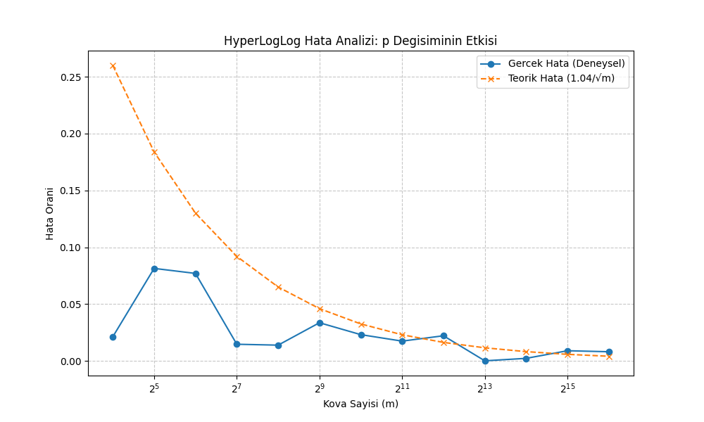

# HyperLogLog (HLL) Kardinalite Tahmini ve Performans Analizi

Bu proje, büyük veri setlerinde eşsiz öğe sayısını (kardinalite) tahmin etmek için kullanılan **HyperLogLog** algoritmasının Python implementasyonunu ve teknik analizini içermektedir. 

##  Genel Bakış
HyperLogLog, bellek verimliliği odaklı olasılıksal bir veri yapısıdır. Geleneksel yöntemler (HashSet vb.) eşsiz öğeleri saymak için $O(N)$ bellek gerektirirken, HLL algoritması $O(\log \log N)$ bellek karmaşıklığı ile çalışır. Bu sayede milyarlarca benzersiz veriyi sadece birkaç kilobayt bellek kullanarak yaklaşık %1-2 hata payı ile tahmin edebilir.

##  Teknik Bileşenler
Algoritmanın başarısını sağlayan temel bileşenler şunlardır:

**Hashing:** Verilerin 64-bitlik bir uzaya düzgün dağılımı (uniform distribution) için **MurmurHash3 (mmh3)** kullanılmıştır.
**Kovalama (Bucketing):** Hash değerinin ilk $p$ biti kullanılarak veri $m = 2^p$ alt kümeye bölünür, bu da hata varyansını azaltır.
**Harmonik Ortalama:** Uç değerlerin (outliers) tahmini bozmasını engellemek amacıyla register değerlerinin harmonik ortalaması alınır.
**Linear Counting:** Küçük veri setlerindeki ($2.5 \times m$) yanlılığı gidermek için düşük kardinalite düzeltmesi uygulanır.
**Merge Özelliği:** Dağıtık sistemlerde kullanılabilmesi için iki farklı HLL yapısının kayıpsız birleştirilmesini destekler.

##  Analiz ve Simülasyon Sonuçları
Proje kapsamında, 100.000 eşsiz öğe içeren bir veri seti üzerinden farklı hassasiyet ($p$) değerleri test edilmiştir. Sonuçlar, teorik hata sınırı olan $1.04/\sqrt{m}$ formülü ile kıyaslanmıştır.

### Performans Tablosu
| Hassasiyet (p) | Kova Sayısı (m) | Tahmin Edilen | Gerçek Hata (%) | Teorik Hata (%) |
| :--- | :--- | :--- | :--- | :--- |
| 4 | 16 | 102.119 | %2.12 | %26.00 |
| 8 | 256 | 98.616 | %1.38 | %6.50 |
| 12 | 4.096 | 102.208 | %2.21 | %1.62 |
| 16 | 65.536 | 100.802 | %0.80 | %0.41 |

### Hata Analizi Grafiği
Aşağıdaki grafikte, kova sayısı arttıkça deneysel hatanın teorik limitlere nasıl yakınsadığı görülmektedir:

-------------------------------------

# HyperLogLog Cardinality Estimation & Performance Analysis

This project implements the **HyperLogLog (HLL)** algorithm from scratch in Python to estimate the number of unique elements (cardinality) in large datasets with minimal memory usage.

##  Overview
HyperLogLog is a probabilistic data structure that provides a near-exact count of unique items. While traditional methods require $O(N)$ space, HLL operates in $O(\log \log N)$ space, allowing it to estimate billions of items using only a few kilobytes of memory. 

##  Technical Components
**Hashing:** Uses **MurmurHash3 (mmh3)** for high-quality, 64-bit uniform distribution.
**Estimation:** Employs the **Harmonic Mean** to reduce the impact of outliers and improve stability. 
**Small Range Correction:** Implements **Linear Counting** for low-cardinality sets to eliminate bias.
**Mergeability:** Supports lossless merging of different HLL instances, ideal for distributed systems.

##  Analysis & Results
The project includes a simulation that compares empirical error rates against the theoretical bound of $1.04/\sqrt{m}$. 

| Precision (p) | Buckets (m) | Actual Error | Theoretical Error |
| :--- | :--- | :--- | :--- |
| 4 | 16 | 2.12% | 26.00% |
| 8 | 256 | 1.38% | 6.50% |
| 12 | 4096 | 2.21% | 1.62% |
| 16 | 65536 | 0.80% | 0.41% |
